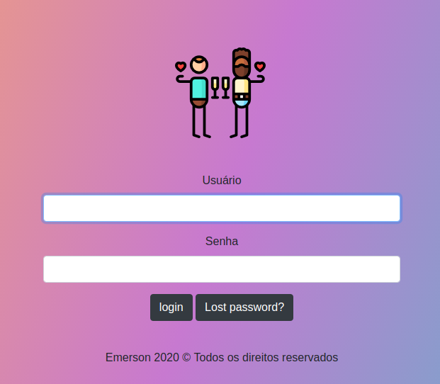
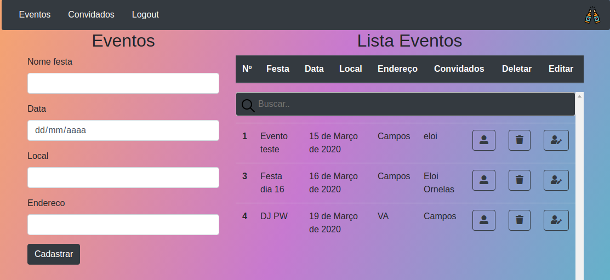

# Descrição

Goytaparty é uma aplicação com o intuito de facilitar sua gestão de convidados e eventos. 

# Aplicação feita em Django

## Passos

### Executando a aplicação via host heroku
Você pode executar a aplicação localmente como também acessar via heroku: http://goytaparties.herokuapp.com 

### Construindo a aplicação localmente

* Instale o [Python](https://www.python.org/downloads/)

Carregando as dependências via requirements.txt:

```bash
pip install -r requirements.txt
python manage.py migrate
```

Executando a aplicação localmente:

```bash
python manage.py migrate
python manage.py createsuperuser (necessário para acessar a aplicação com user e password)
python manage.py runserver
```

Sua aplicação por padrão irá executar na url: `http://127.0.0.1:8000`.
<div>

</div>
<br>

<div>

</div>